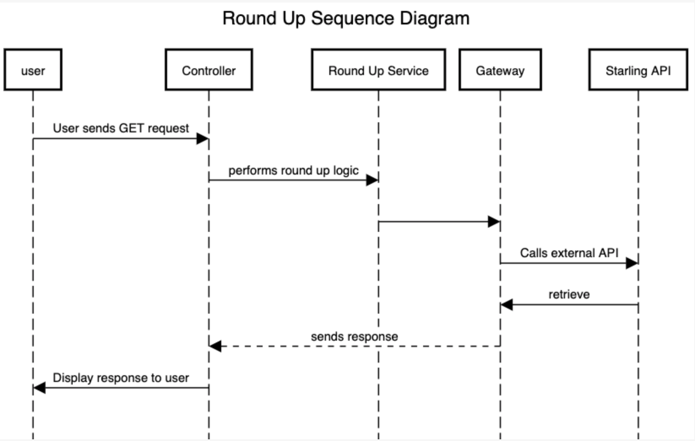

# Edward Ntim Starling Tech Challenge

### Service requirements 
- Java 11
- Maven

### Environment variables 
The following env variables must be set up before running the test and service. The `bearer_token` can be found by generating a refresh token for the user in sandbox. 
You can set this in your `.zshrc` `.bash_profile` file or export the following into your terminal.

The `sandbox_api` can be found here - https://developer.starlingbank.com/docs
```
export STARLING_URL=<sandbox_api>

export BEARER_TOKEN=<your_bearer_token>
```

### Set up & Build

Environment values must be setup before running the following steps.

Install maven dependencies
- `mvn install` 

The service can be run with
- `mvn spring-boot:run` or you can start the application from `main` class by clicking the play green button. 

Tests can be run with 
- `mvn test`

### Endpoint to invoke
I opted to handle the `within a given week` feature by adding the `dateTimeFrom` and `dateTimeTo` 
query parameters as a part of the url. The `accountUid` can be found in the sandbox account user response.

``http://localhost:8080/round-up/account/{accountUid}?dateTimeFrom={dateTimeFrom}&dateTimeTo={dateTimeTo}``

### Architecture
Sequence diagram of service flow



### Further improvements  

For proof of concept I hard coded the `currency` type to be `GBP`. Ideally this should be an enum type with different currency codes. In addition, currency conversion e.g. 
If the user has made transactions in two different countries the conversion rate can be applied to the round up. 

I would include logs for better visibility when the service is running.

Happy to have a discussion about service design and different approaches to the task.
